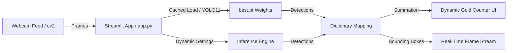

# 💵 Real-time Egyptian Currency Counter

A modern, high-performance web application designed to detect, classify, and count Egyptian currency bills in real-time. Built on top of **YOLO11n** (via the `ultralytics` library) and powered by an elegant, dark-gold glassmorphism **Streamlit** dashboard UI.

---

## 🚀 End-to-End YOLO11 Pipeline Architecture



1. **Video Capture**: OpenCV (`cv2.VideoCapture(0)`) accesses the system's local camera and streams frames directly to the application backend.
2. **Model Optimization**: The YOLO11n model weights (`best.pt`) are loaded once and cached via `@st.cache_resource` to eliminate inference lag on slider updates or script reruns.
3. **Inference**: Each frame is evaluated by the model using dynamic settings defined by the user (Confidence & IoU thresholds).
4. **Denomination Mapping**: The model's raw class predictions are passed through an exact dual-sided classification dictionary:
   - **5 EGP**: Class 10
   - **10 EGP**: Classes 0, 1, 3
   - **20 EGP**: Classes 5, 9
   - **50 EGP**: Classes 2, 8
   - **100 EGP**: Classes 4, 11
   - **200 EGP**: Classes 6, 7
5. **Aesthetics & Rendering**: Colored bounding boxes matching specific bill colors are drawn on the frame, and the accumulated value is dynamically displayed in a luxury neon gold counter panel in the UI.

---

## ✨ Key Features
*   **Real-time Live Stream**: Native camera feed toggle for Starting/Stopping local video capture.
*   **Dual-Side Detection**: Mapped to recognize both the front and back faces of Egyptian currency.
*   **Aesthetic UI**: Dark theme dashboard using Google Fonts, custom CSS glassmorphism, responsive grid layout, and an active blinking system status indicator.
*   **Dynamic Customization**: Interactive sidebar sliders for live adjustments of model parameters.
*   **High Performance**: Minimal CPU overhead with cached loaders and optimized frame sleep intervals.
*   **Standalone Bundle**: Integrated builder tool to pack the application and all dependencies into a single Windows `.exe`.

---

## 🛠️ Prerequisites & Installation

### 1. Requirements
*   **OS**: Windows 10/11 (for PyInstaller executable building)
*   **Python**: Python 3.12.10

### 2. Set Up Environment
Create a clean virtual environment and install the required dependencies:

```bash
# Create virtual environment
python -m venv .venv

# Activate virtual environment
# On Windows (Command Prompt)
.venv\Scripts\activate.bat
# On Windows (PowerShell)
.venv\Scripts\Activate.ps1

# Install requirements
pip install -r requirements.txt
```

---

## 🏃 How to Run the Web UI

### Option A: Standard Streamlit Startup
Run the Streamlit server directly:
```bash
streamlit run app.py
```

### Option B: Wrapper Execution
Run the programmatic launcher script (this is the same flow used by the compiled executable):
```bash
python run_app.py
```
This boots the Streamlit server on `localhost:8501` and opens your default browser automatically.

---

## 📦 Bundling into a Standalone Windows Executable (.exe)

This project contains a programmatic PyInstaller builder script `build_exe.py` that handles copying dependencies (including PyTorch, OpenCV, and Streamlit's static runtime folders) into a single self-contained executable.

### Build Instructions:
1. Ensure your virtual environment is active and all dependencies in `requirements.txt` are installed.
2. Run the builder script:
   ```bash
   python build_exe.py
   ```
3. PyInstaller will compile the app and place the output in the `dist/` directory:
   *   **Output**: `dist/EgyptianCurrencyCounter.exe`

*Note: The YOLO model weights `best.pt` will be bundled directly inside the executable. If you want to update the model in the future, simply place a new `best.pt` file in the same directory as the `.exe` file. The application will automatically detect and load the external weights over the bundled ones!*

---

## 🎮 Steam Integration Compatibility

You can run this application directly through the **Steam Client** by adding it as a **Non-Steam Application**. This is useful for tracking your application usage, launching it from a handheld (like a Steam Deck or Windows Handheld running Steam Big Picture), or using Steam Overlay / Controller bindings.

### How to Add to Steam:
1. Open the **Steam Client** on Windows.
2. In the bottom-left corner, click **Add a Game** > **Add a Non-Steam Game...**
3. In the dialog that pops up, click **Browse...**
4. Navigate to your project directory and select the built executable:
   `dist/EgyptianCurrencyCounter.exe`
5. Click **Add Selected Programs**.
6. The application will now appear in your Steam Library under the name `EgyptianCurrencyCounter`.
7. **Launch**: Click **Play**. Steam will initialize the server backend in the background and launch your default browser to display the interactive camera interface.
